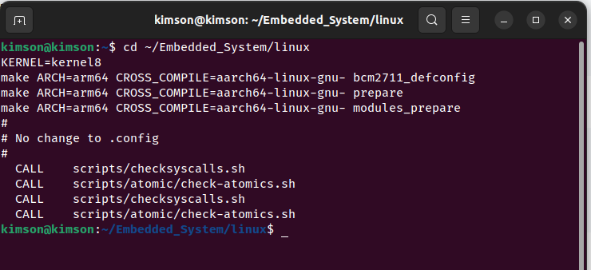
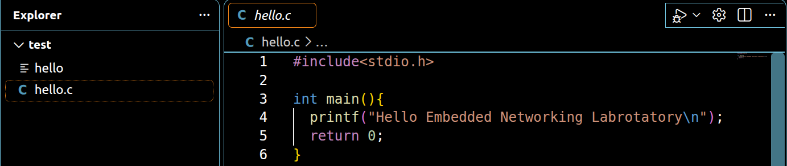
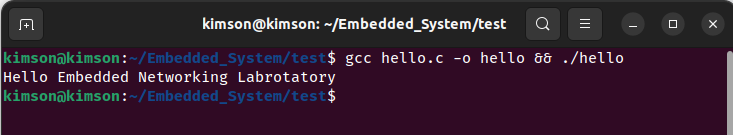

# Cross-Compile
Instruct cross-compile a program from host device to Raspberry Pi4 using Linux OS 64 bit

## Table of contents
- [Introduction](#introduction)
- [How to cross-compile a program to Raspberry Pi4 using Linux OS64 bit](#how-to-cross-compile-a-program-to-raspberry-pi4-using-linux-os-64-bit)
- [Credits and References](#credits-and-references)
- [Thanks to](#thanks-to)

## Introduction
A full turtorial how to cross-compile a program from your computer to Raspberry Pi4 using Linux OS 64 bit. Aim of this guide is instruct step by step get acquainted with Raspberry Pi4 especially cross-compile a cornerstone of Embedded Linux get ready for next topic  that i will cover.

Raspberry Pi is know as a small computer with full features like our computer.However, it is challenging because of limitations of hardware. Cross-compile provide a solutions when you can build and compile a program in your own devices like laptop or computer then translate to language that Raspberry Pi can understand and run it. Program in our computer is easier due to available tools for coding and debuging and faster due to strong power of hardware. 

## How to cross-compile a program to Raspberry Pi4 using Linux OS 64 bit
### 1. Install Necessary Tools  
To cross-compile a driver for PCA9685, you need to set up the following tools:  
The cross-compiler (`arm-linux-gnueabihf-gcc`) and supporting packages:  
```bash
sudo apt update
sudo apt install -y git bc bison flex libssl-dev make libc6-dev libncurses5-dev
sudo apt install -y crossbuild-essential-arm64
```
If `crossbuild-essential-armhf` cannot be installed, you can install the `gcc-arm-linux-gnueabihf` package separately:  
```bash
sudo apt install -y gcc-aarch64-linux-gnu
```

### 2. Download the Linux Source Code  
You need to download the appropriate kernel source for Raspberry Pi 4 (BCM2711). Raspberry Pi uses a customized branch of the Linux kernel, which can be obtained from the Raspberry Pi GitHub repository:  
```bash
mkdir Embedded_System
cd Embedded_System
git clone --branch rpi-5.4.y --depth=1 https://github.com/raspberrypi/linux.git
```

### 3. Configure the Kernel
```bash
cd ~/Embedded_System/linux
KERNEL=kernel8
make ARCH=arm64 CROSS_COMPILE=aarch64-linux-gnu- bcm2711_defconfig
make ARCH=arm64 CROSS_COMPILE=aarch64-linux-gnu- prepare
make ARCH=arm64 CROSS_COMPILE=aarch64-linux-gnu- modules_prepare
```


### 4. Create a test direction
```bash
cd ..
mkdir test #Make a test folder 
cd test
touch hello.c
code hello.c
```

You can make your own program to test, this is a example:
```bash
#include<stdio.h>

int main(){
  printf("Hello Embedded Networking Labrotatory\n");
  return 0;
}
```

Then compile program and run for testing:
```bash
gcc hello.c -o hello && ./hello
```

After that, compile to file that Raspberry can understand and run
```bash
aarch64-linux-gnu-gcc hello.c -o hello 
```

### 5. Install the Kernel Module on the Target Device  
- Once the compilation is successful, open a new terminal window, connect to the Wi-Fi network named the same as the Wi-Fi your Raspberry Pi is connecting.  
- Use the following command to SSH into the Raspberry Pi from your virtual machine:  
  ```bash
  ssh ubuntu@192.168.0.120
  ```  
- When prompted with `yes/no`, type `yes` and press Enter, then enter the password `1` to complete the connection. Then the terminal will change to the Raspberry Pi4 terminal with username is ubuntu.
- Open a new terminal in your window and transfer the `test` folder to the Raspberry Pi using:
```bash
scp -r /home/username/Embedded_System/test ubuntu@192.168.0.120:/home/ubuntu #change the username to your username
```
- Change the terminal into Raspberry Pi4 terminal named ubuntu, you can see all the folder and program:
```bash


ls
chmod +x hello.c #grant execute permission to program hello.c
./hello #run the program and print into your terminal
```

## Credits and References
This project is based on:
[Cross-Compile](https://github.com/EmNetLab411/Multimedia-Embedded-Systems/tree/main/Cross_compile_driver)

Modified and adapted for the target embedded platform.

## Thanks to
[Embedded Networking Labrotatory](https://www.facebook.com/lab411)

Tran Luong Duy 20213751 Hanoi University of Science and Technology

